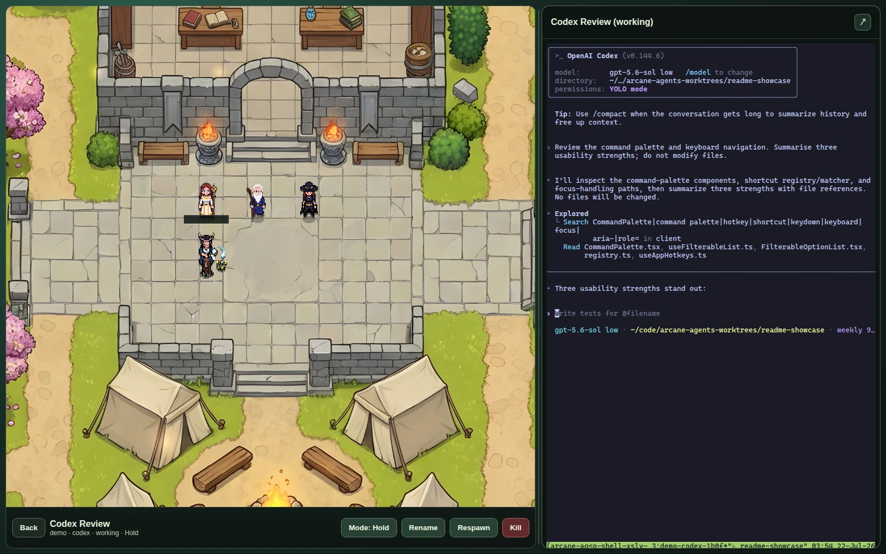
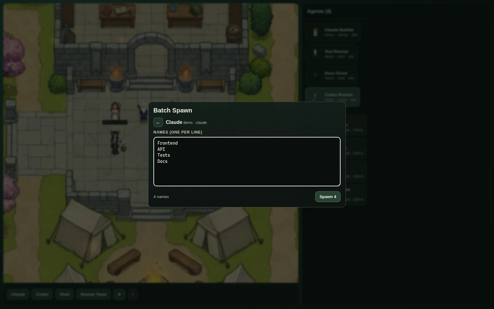
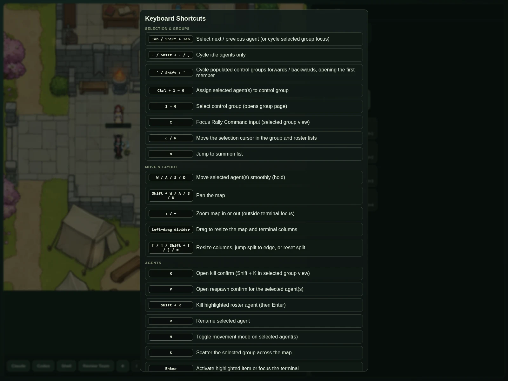
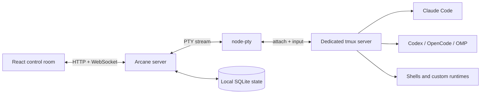

<div align="center">

# Arcane Agents

**A local-first visual control room for terminal-backed AI agents.**

Run Claude Code, Codex, OpenCode, Oh My Pi, shells, and custom terminal workflows as a party of pixel-art characters—without giving up tmux, your terminal, or control of your machine.

<p>
  <a href="https://github.com/thomasrice/arcane-agents/actions/workflows/ci.yml"></a>
  <a href="https://www.npmjs.com/package/arcane-agents"></a>
  
  
  <a href="LICENSE"></a>
</p>

</div>



Arcane Agents gives each local agent a place on a shared map and keeps its real terminal one click away. Spawn a team, see who is working or waiting for input, organise agents into control groups, broadcast a command, and jump directly into the terminal that needs you.

> **Local-first:** Arcane Agents has no hosted backend or Arcane account. Worker state lives in SQLite, processes live in a dedicated tmux server, and terminal traffic stays between your browser and your machine.

[Quick start](#quick-start) · [Feature tour](#feature-tour) · [Keyboard controls](#keyboard-controls) · [Configuration](#configuration) · [Development](#development)

## Why Arcane Agents?

<table>
<tr>
<td width="50%"><strong>See the whole team</strong><br>Agents become characters on a shared map with live <code>idle</code>, <code>working</code>, <code>attention</code>, <code>error</code>, and <code>stopped</code> states.</td>
<td width="50%"><strong>Keep the real terminal</strong><br>Every character is backed by tmux. Attach through the embedded xterm.js panel or open the same session in an external terminal.</td>
</tr>
<tr>
<td width="50%"><strong>Coordinate, not just observe</strong><br>Use control groups, batch spawning, rally commands, keyboard movement, rename, scatter, respawn, and kill actions without leaving the control room.</td>
<td width="50%"><strong>Bring your own runtime</strong><br>Claude Code, Codex, OpenCode, Oh My Pi, shells, test watchers, and any other terminal command can share the same interface.</td>
</tr>
</table>

## Feature tour

### Visual agent control room

- Pixel-art agents inhabit a depth-aware 2D map with animated movement, labels, effects, scenery occlusion, and selectable character packs.
- Select one agent, Shift-click several, or draw a marquee around a group.
- Move selected agents with held `W/A/S/D` or the arrow keys; the camera follows near the map edge.
- Right-click a destination to send selected agents there, right-drag to pan, and use `+` / `-` to zoom.
- Switch agents from the map or roster, cycle workers that need attention or are idle, and jump through populated control groups.
- Resize the map and terminal split by dragging the divider or using keyboard controls.

### Real terminals, not simulated chat panels

- Each worker is a tmux window driven through `node-pty` and streamed over WebSockets.
- The embedded xterm.js terminal supports normal interactive programs, colour, resize, mouse input, and low-latency typing.
- Open the selected worker in an external terminal on supported Linux desktops.
- Browser reconnects do not kill the underlying process; Arcane reconciles persisted worker state with tmux.
- Drag-select terminal text to copy it to the clipboard of the computer viewing Arcane Agents—even when the server runs on another machine.

### Fast spawning and project discovery

- Save project + runtime shortcuts as buttons and assign configurable hotkeys.
- Open the `/` command palette to search shortcuts and every available project/runtime combination.
- Spawn a custom project/runtime pair from the `+` dialog.
- Batch-spawn a named team from a multiline list; duplicate names are numbered automatically.
- Discover projects from directories, glob patterns, or Git worktrees instead of listing every checkout manually.
- Spawn new workers near a selected group so related agents begin together on the map.

### Control groups and team commands

- Assign any selection to groups `1–0`, select a group instantly, and cycle populated groups forwards or backwards.
- Open a group page, move through members with `J/K` or `Tab`, and focus any member's terminal.
- Send one rally command to every selected agent; `$NAME` expands to each agent's display name.
- Rename an individual or a whole group, scatter grouped characters, change movement mode, respawn stopped agents, or kill selected workers.

### Status, attention, and completion

- Dedicated runtime adapters understand current Claude Code, Codex, OpenCode, and Oh My Pi terminal states, with a generic fallback for other commands.
- Arcane distinguishes active work from an idle prompt, native approvals, questions that need an answer, runtime errors, and stopped processes.
- Claude transcript correlation and live pane signals reduce false working/idle transitions in long-lived sessions.
- Completed but unreviewed agents receive a `READY` badge, making finished work easy to scan.
- Optional character voice lines and sound effects announce arrival, movement, attention, completion, and death.
- Transition history, evaluation facts, flap counts, and exportable status fixtures make incorrect classifications reproducible.

### Local state and independent sessions

- SQLite stores workers, positions, names, groups, and state locally.
- Arcane uses its own configurable tmux socket and session, leaving your normal tmux setup untouched.
- Named Arcane sessions provide independent worker databases and tmux parties while sharing one configuration.
- The server can bind to a LAN or private VPN interface for access from another computer; see [Network access and security](#network-access-and-security) before enabling it.

## More screenshots

<table>
<tr>
<td width="50%">

<br><sub><strong>Batch spawn:</strong> turn a list of workstreams into a named agent team.</sub>
</td>
<td width="50%">

<br><sub><strong>Keyboard-first:</strong> selection, groups, movement, agent actions, and overlays stay close at hand.</sub>
</td>
</tr>
</table>

## Quick start

### Requirements

- Node.js 20 or newer and npm
- tmux
- At least one terminal runtime command, such as `claude`, `codex`, `opencode`, `omp`, or `bash`
- Optional: `git` for project/worktree discovery and `xdg-terminal-exec` for the Linux external-terminal button

### Install

```bash
npm install -g arcane-agents
arcane-agents setup
arcane-agents
```

`arcane-agents setup` checks for tmux, offers the appropriate installation command after confirmation, creates a starter configuration when needed, and runs the built-in doctor checks.

Open [http://127.0.0.1:7600](http://127.0.0.1:7600).

Edit the generated configuration at any time:

```bash
arcane-agents config edit
```

Useful maintenance commands:

```bash
npm install -g arcane-agents@latest  # upgrade
npm uninstall -g arcane-agents       # uninstall
```

### Platform notes

| Platform | Support |
|---|---|
| Linux | Fully supported and recommended. The external-terminal button uses `xdg-terminal-exec`. |
| macOS | The core app, tmux management, and embedded terminal work. Opening an agent in an external terminal is currently Linux-oriented. |
| Windows | Run Arcane Agents inside WSL2 with Ubuntu or another Linux distribution. |

If installing tmux manually:

```bash
# Debian / Ubuntu / WSL2
sudo apt install tmux

# macOS with Homebrew
brew install tmux
```

## How it works



The browser owns the visual control room and terminal viewer. The server owns orchestration, persistence, tmux reconciliation, process inspection, and status decisions. The agents themselves remain ordinary terminal programs.

## Everyday workflow

1. Add projects, runtimes, and favourite launch shortcuts to the YAML configuration.
2. Spawn an agent from the bottom bar, command palette, custom dialog, or batch-spawn flow.
3. Select its character to attach the live terminal; press `Enter` to focus terminal input.
4. Leave terminal focus with the configured chord (default `Ctrl+Alt+]`) and move around the roster or map.
5. Group related agents with `Ctrl+1–0`, then select the group with `1–0` and broadcast a rally command.
6. Watch status nameplates and the roster. Open agents marked `READY` to review completed work.

## Keyboard controls

Press `?` in Arcane Agents for the live shortcut reference. The panel is generated from the same registry that handles the keys, so the displayed controls stay in sync with the application.

### Selection and groups

| Keys | Action |
|---|---|
| `Tab` / `Shift+Tab` | Select the next or previous agent; inside a group, cycle focused members. |
| `Space` / `Shift+Space` | Select and centre the next or previous agent that needs input. |
| `.` / `Shift+.` / `,` | Cycle idle agents only. |
| Backtick / `Shift+Backtick` | Cycle populated control groups forwards or backwards and open the first member. |
| `Ctrl+1–0` | Assign selected agents to a control group. |
| `1–0` | Select a control group and open its group page. |
| `J` / `K` | Move the selection cursor through group and roster lists. |
| `N` | Jump to the summon list in the roster. |
| `C` | Focus the Rally Command input on a selected group page. |

### Movement and layout

| Keys or gesture | Action |
|---|---|
| `W/A/S/D` or arrows | Move selected agents smoothly while held. |
| `Shift+W/A/S/D` or `Shift+arrows` | Pan the map. |
| Right-click | Send selected agents to the clicked destination. |
| Right-drag | Pan the map with the pointer. |
| Left-drag empty map | Marquee-select agents. |
| Shift-click agent | Add or remove one agent from the selection. |
| `+` / `-` | Zoom in or out. |
| `[` / `]` | Resize map and terminal columns. |
| `Shift+[` / `Shift+]` | Jump the split to either edge. |
| `=` | Reset the split. |

### Agent actions and overlays

| Keys | Action |
|---|---|
| `Enter` | Activate the highlighted item or focus the selected terminal. |
| `R` | Rename the selected agent or group. |
| `M` | Toggle movement mode for selected agents. |
| `S` | Scatter a selected group across the map. |
| `P` | Open the respawn confirmation. |
| `K` | Open the kill confirmation for selected agents. |
| `Shift+K` | Kill the highlighted roster agent after confirmation. |
| `/` | Open the command palette. |
| `?` | Toggle the keyboard shortcut reference. |
| `Esc` | Close an overlay or dialog, then clear selection. |
| `Ctrl+Alt+]` | Leave terminal focus; configurable through `keybindings.leaveTerminalFocus`. |

<details>
<summary><strong>Clipboard behaviour</strong></summary>

Drag-select text in an embedded terminal to copy it to the clipboard of the computer viewing Arcane Agents, not merely the host running the tmux session. tmux emits the selection through OSC 52 and the browser writes it locally.

Over plain `http://<host>:7600`, the modern asynchronous clipboard API is unavailable, so Arcane uses a legacy copy fallback during the mouse gesture. For native clipboard access across a tailnet, expose the local app through HTTPS—for example with Tailscale Serve—and browse the resulting `*.ts.net` URL.

Programs inside a pane cannot read the viewer's clipboard through this path. Hold `Shift` while dragging to use ordinary browser text selection instead of tmux selection.

</details>

## Configuration

Configuration is loaded at server startup in this order:

1. Built-in defaults
2. `~/.config/arcane-agents/config.yaml`
3. `~/.config/arcane-agents/config.local.yaml`

The local override is useful for machine-specific paths or commands you do not want in a shared dotfiles repository. Restart the server after changing configuration.

```bash
arcane-agents config path  # print config and local override paths
arcane-agents config show  # print the primary YAML file
arcane-agents config edit  # open the primary file in $VISUAL or $EDITOR
arcane-agents doctor       # check the local environment
```

### Generic example

```yaml
projects:
  app:
    path: ~/code/my-app
    shortName: app
    label: Example App
  docs:
    path: ~/code/product-docs
    shortName: docs
    label: Product Docs

runtimes:
  claude:
    command: ["claude"]
    label: Claude Code
  codex:
    command: ["codex"]
    label: Codex
  opencode:
    command: ["opencode"]
    label: OpenCode
  omp:
    command: ["omp"]
    label: Oh My Pi
  shell:
    command: ["bash"]
    label: Shell

shortcuts:
  - label: App Claude
    project: app
    runtime: claude
    hotkeys: ["Ctrl+1"]
    avatar: elder-wizard
  - label: App Codex
    project: app
    runtime: codex
    hotkeys: ["Ctrl+2"]
  - label: Docs Shell
    project: docs
    runtime: shell
    hotkeys: ["Ctrl+3"]
```

A complete starter file is available at `config.example.yaml`.

<details>
<summary><strong>Configuration reference</strong></summary>

### Top-level sections

| Section | Purpose |
|---|---|
| `projects` | Named working directories in which agents launch. |
| `runtimes` | Terminal commands and labels, with optional status freshness overrides. |
| `shortcuts` | Saved project/runtime recipes, hotkeys, command overrides, and pinned avatars. |
| `keybindings` | Configurable application keybindings. |
| `discovery` | Automatic project discovery from directories, worktrees, or globs. |
| `status` | Interactive-command filtering for status detection. |
| `audio` | Client sound enablement. |
| `avatars` | Avatar types excluded from random assignment. |
| `backend.tmux` | Dedicated tmux socket, session, and polling interval. |
| `server` | API host and port. |

### Projects

Each project requires `path` and `shortName`; `label` is optional.

```yaml
projects:
  app:
    path: ~/code/my-app
    shortName: app
    label: Example App
```

### Runtimes

Each runtime requires a `command` array and `label`. `freshnessWindowMs` optionally overrides the generic idle-detection window for a custom runtime; known agent runtimes use adapter-specific windows.

```yaml
runtimes:
  pipeline:
    command: ["bin/run-pipeline"]
    label: Pipeline
    freshnessWindowMs: 60000
```

### Shortcuts

Each shortcut requires `label`, `project`, and `runtime`. Optional fields are `command`, `hotkeys`, and `avatar`.

```yaml
shortcuts:
  - label: Tests
    project: app
    runtime: shell
    command: ["npm", "test", "--", "--watch"]
    hotkeys: ["Ctrl+T"]
    avatar: elder-wizard
```

### Keybindings

`keybindings.leaveTerminalFocus` replaces the default terminal-exit chord list. Chords not listed here pass through to the terminal, so `Ctrl+D` retains its normal EOF/logout behaviour by default.

```yaml
keybindings:
  leaveTerminalFocus: ["Ctrl+Alt+]"]
```

### Discovery

Discovery rules support `worktrees`, `directories`, and `glob`. A directory rule can use `match`, `exclude`, and `maxDepth`.

```yaml
discovery:
  - name: code-projects
    type: directories
    path: ~/code
    match: ".git"
    exclude: ["node_modules", ".cache", "dist"]
    maxDepth: 2
  - name: app-worktrees
    type: worktrees
    path: ~/code/my-app
  - name: playgrounds
    type: glob
    path: ~/code/playground/*
```

### Status filtering

Interactive programs such as editors and process monitors change terminal output because of user input or screen refreshes. `interactiveCommands` replaces Arcane's default list; `extraInteractiveCommands` extends it.

```yaml
status:
  extraInteractiveCommands:
    - my-custom-editor
```

The built-in list includes `nvim`, `vim`, `vi`, `nano`, `helix`, `hx`, `emacs`, `emacsclient`, `less`, `more`, `man`, `htop`, `btop`, `top`, `watch`, `lazygit`, `lazydocker`, `ranger`, `nnn`, `lf`, `yazi`, and `tmux`.

### tmux backend

```yaml
backend:
  tmux:
    socketName: arcane-agents
    sessionName: arcane-agents
    pollIntervalMs: 2500
```

The dedicated socket lets Arcane ship mouse- and clipboard-friendly tmux defaults without changing your main tmux configuration. `pollIntervalMs` has a minimum of 250 ms.

### Audio and avatars

```yaml
audio:
  enableSound: true

avatars:
  disabled:
    - gothic-witch
```

A disabled avatar is excluded from random allocation but remains available when explicitly pinned to a shortcut.

### Server

```yaml
server:
  host: 127.0.0.1
  port: 7600
```

`ARCANE_AGENTS_API_HOST` and `ARCANE_AGENTS_API_PORT` override these YAML values at startup.

</details>

## Named sessions

Named sessions run independent Arcane instances with separate SQLite databases and tmux sessions while sharing projects, runtimes, shortcuts, and other configuration.

```bash
arcane-agents start                         # default session
arcane-agents start --session side-project  # named session
arcane-agents start -s experiments
arcane-agents sessions list
arcane-agents sessions delete side-project
```

The default database lives at `~/.local/state/arcane-agents/arcane-agents.db`. Named databases live under `~/.local/state/arcane-agents/sessions/<name>/arcane-agents.db`.

## Network access and security

To bind the built app to every network interface:

```bash
ARCANE_AGENTS_API_HOST=0.0.0.0 npm run start
```

> [!WARNING]
> Arcane Agents does not provide built-in authentication. Binding to `0.0.0.0` exposes the UI, API, and terminal WebSocket to every device that can reach the port. Use a trusted LAN, firewall, or authenticated private VPN such as Tailscale. Never expose the port directly to the public internet.

For development access from another machine:

```bash
npm run dev -- --host
npm run dev -- --host --allow-host your-private-hostname
```

You can also bind Vite to a specific private interface with `npm run dev -- --host 192.168.1.42`.

## Development

```bash
git clone https://github.com/thomasrice/arcane-agents.git
cd arcane-agents
npm install
npm run cli -- setup
npm run dev
```

Development URLs:

- Vite app: [http://127.0.0.1:7600](http://127.0.0.1:7600)
- Express API: [http://127.0.0.1:7601](http://127.0.0.1:7601)

Quality and build commands:

```bash
npm run typecheck
npm run lint
npm run test:ci
npm run build
npm start
```

The production app defaults to [http://127.0.0.1:7600](http://127.0.0.1:7600). Health endpoints are available at `/api/health` on the relevant server port.

### Status debugging

Set `ARCANE_AGENTS_STATUS_TRACE=transitions` to log status changes or `ARCANE_AGENTS_STATUS_TRACE=verbose` to log every evaluation.

```bash
ARCANE_AGENTS_STATUS_TRACE=transitions npm run dev:server
```

Debug endpoints:

- `GET /api/status-debug` — all workers, including transition flap counts
- `GET /api/workers/:workerId/status-debug` — recent evaluations and decision facts
- `GET /api/workers/:workerId/status-history` — status transition history
- `GET /api/workers/:workerId/status-fixture` — export the current or a recent transition as a reproducible integration-test fixture

### Project layout

```text
src/
  client/   React UI, map runtime, render layers, xterm terminal
  server/   API, orchestration, tmux, persistence, status monitor
  shared/   Shared types and configuration models
assets/     Maps, character sprites, and optional voice lines
```

## Custom avatars

Avatar packs are directory-driven under `assets/characters/<avatar-type>/`. The required sprite files are documented in `assets/characters/README.md`; a compliant folder becomes available automatically.

Optional voice clips live in `assets/characters/<avatar-type>/voice-lines/`. Fixed events use `arrive.mp3`, `attention.mp3`, `complete.mp3`, and `death.mp3`; random variants match `move*.mp3` and `selected*.mp3`.

## Demo

<p align="center">
  <video src="https://github.com/user-attachments/assets/b85ee107-17f4-4a78-b546-71951adeabd3" controls width="720"></video>
</p>

[Watch the original demo on YouTube →](https://youtu.be/vOUcloQTCoQ)

## Stack

TypeScript · React · Vite · Express · WebSockets · xterm.js · node-pty · tmux · SQLite

## License

Arcane Agents is available under the [MIT License](LICENSE).
